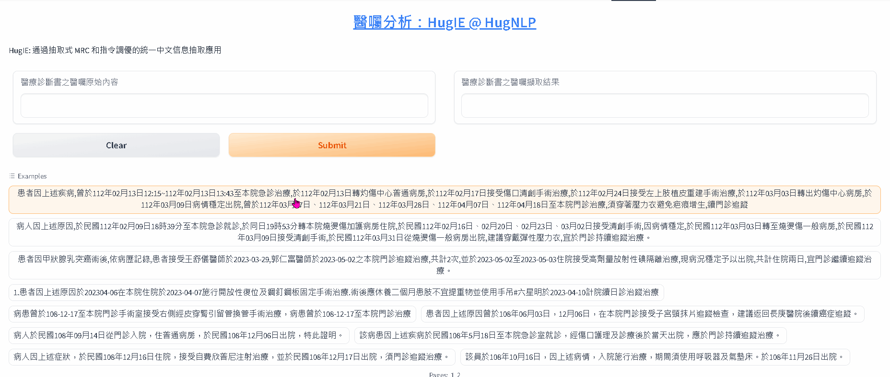

[Jianing Wang, Nuo Chen, Qiushi Sun, Wenkang Huang, Chengyu Wang, Ming Gao, "HugNLP: A Unified and Comprehensive Library for Natural Language Processing", arXiv preprint, 	arXiv:2302.14286, 2023](https://arxiv.org/abs/2302.14286)

[github](https://github.com/HugAILab/HugNLP)

In this paper, we introduce HugNLP, a unified and comprehensive library for natural language processing (NLP) with the prevalent backend of HuggingFace Transformers, which is designed for NLP researchers to easily utilize off-the-shelf algorithms and develop novel methods with user-defined models and tasks in real-world scenarios. HugNLP consists of a hierarchical structure including models, processors and applications that unifies the learning process of pre-trained language models (PLMs) on different NLP tasks. Additionally, we present some featured NLP applications to show the effectiveness of HugNLP, such as knowledge-enhanced PLMs, universal information extraction, low-resource mining, and code understanding and generation, etc. The source code will be released on GitHub (https://github.com/wjn1996/HugNLP).

[HugIE: A Unified Chinese Information Extraction Framework via Extractive Instruction Prompting](https://github.com/HugAILab/HugNLP/blob/main/documents/information_extraction/HugIE.md)

[基於機器閱讀理解(MRC)的指令微調(Instruction-tuning)的統一信息抽取框架之診斷書醫囑擷取分析](https://blog.twman.org/2023/07/HugIE.html)

