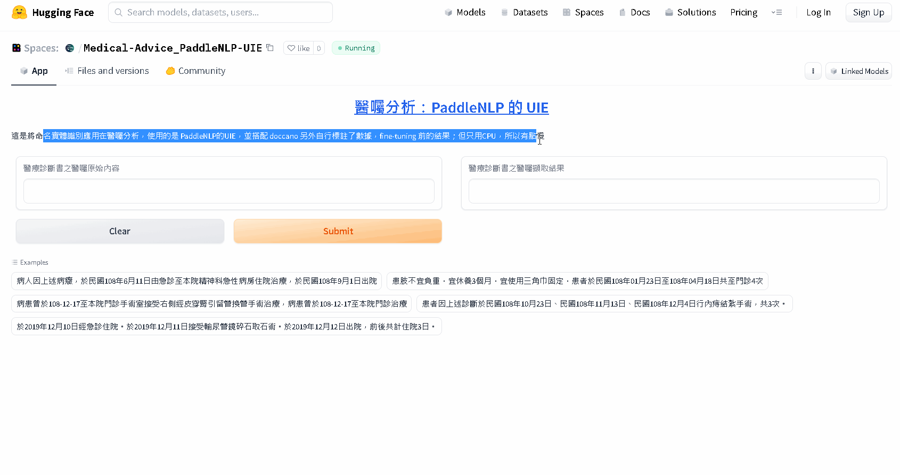
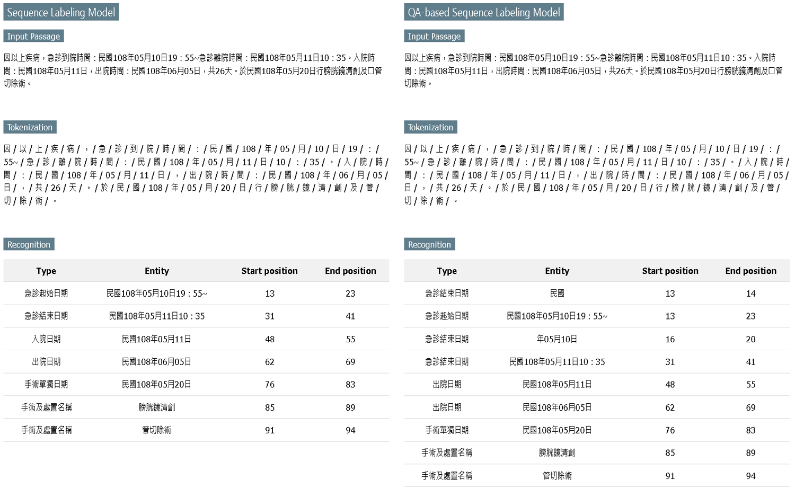

[Jianing Wang, Nuo Chen, Qiushi Sun, Wenkang Huang, Chengyu Wang, Ming Gao, "HugNLP: A Unified and Comprehensive Library for Natural Language Processing", arXiv preprint, 	arXiv:2302.14286, 2023](https://arxiv.org/abs/2302.14286)

[github](https://github.com/HugAILab/HugNLP)

In this paper, we introduce HugNLP, a unified and comprehensive library for natural language processing (NLP) with the prevalent backend of HuggingFace Transformers, which is designed for NLP researchers to easily utilize off-the-shelf algorithms and develop novel methods with user-defined models and tasks in real-world scenarios. HugNLP consists of a hierarchical structure including models, processors and applications that unifies the learning process of pre-trained language models (PLMs) on different NLP tasks. Additionally, we present some featured NLP applications to show the effectiveness of HugNLP, such as knowledge-enhanced PLMs, universal information extraction, low-resource mining, and code understanding and generation, etc. The source code will be released on GitHub (https://github.com/wjn1996/HugNLP).

## [HugNLP](#hugie)

[基於機器閱讀理解(MRC)的指令微調(Instruction-tuning)的統一信息抽取框架之診斷書醫囑擷取分析](https://blog.twman.org/2023/07/HugIE.html)

針對診斷書醫囑文字分析的開發過程記錄，分別嘗試了五種演算法，依序是 PaddleNLP的UIE、ChatGPT 3.5、UniIE、InstructUIE、HugIE

整個想要處理的是將如上所提供的範例診斷書，先透過光學文字識別(OCR)，得到相關資料後，再進一步針對診斷書其醫囑文字做分析；那就再來看看要對醫囑(範例)產出怎樣的結果，首先，就是要從醫囑中分析出以下各個字詞跟其關係。

- (A) 住院: 起始日, 終止日, 天數
- (B) 燒燙傷: 起始日, 終止日
- (C) 加護病房: 起始日, 終止日
- (D) 門診: 起訖日, 次數
- (F) 手術: 起訖日, 項目, 次數
- (G) 急診: 起始日, 終止日, 起始時間, 終止時間
- (H) 癌症化療: 起始日, 終止日, 次數
- (I) 罹癌: 起始日, 終止日
- (J) 癌症放射線: 次數, 起始日, 終止日

## 醫囑範例
1. 病患曾於108年11月10日12：08~108年11月11日19：41至本院急診治療，於民國108年11月11日住院，住院中持續接受內科治療與氧氣治療，於108年11月21日出院，出院後需使用居家呼吸器以及製氧機，宜門診追蹤治療"
2. 病人於民國108年09月14日從門診入院，住普通病房，於民國108年12月06日出院，特此證明。
3. 該病患因上述疾病於民國108年5月18日至本院急診室就診，經傷口護理及診療後於當天出院，應於門診持續追蹤治療。
4. 病人因上述疾病於2019年12月11日入院接受治療，於2019年12月16日出院，共住院6日，宜門診繼續追蹤治療
5. 病人因上述症狀，於民國108年12月16日住院，接受自費欣普尼注射治療，並於民國108年12月17日出院，須門診追蹤治療。

如果這是一條醫囑：" **患者因上述原因於民國112年5月10日來院接受子宮腔鏡瘜肉切除手術依病歷記錄患者接受醫師於2023-05-02、2023-05-09,醫師於2023-05-16、2023-05-19之本院門診追蹤治療共計4次。**" 那其結果應該要跟據前述字詞分析出像這樣的結果：

- 門診起始日：1120502
- 門診終止日：1120502
- 門診起始日：1120509
- 門診終止日：1120509
- 門診起始日：1120510
- 門診終止日：1120510
- 門診起始日：1120516
- 門診終止日：1120516
- 門診起始日：1120519
- 門診終止日：1120519
- 手術起始日：1120510
- 手術終止日：1120510
- 手術名稱：子宮腔鏡瘜肉切除手術

從上面這個範例，可以發現即使只提到門診日期，且門診通常是單一天結束，你不只要能識別出有門診這個項目，還需要能自主識別分析出起始日和終止日皆是同日的結果；同理，手術也一樣，並且要抓出手術名稱。

再來一條醫囑範例："**病人因上述疾病,於民國112年04月05日入住本院-般病房,於民國112年04月06日接受脊髓鞘內射化學藥物治療於民國112年04月07日至民國112年05月07日接受自費百利妥射劑靜脈津特化學治療,於民國112年05月09日出院,出院後宜休春並持續追蹤治療。**"

- 住院起始日：1120405
- 住院終止日：1120509
- 癌症化療起始日：1120406
- 癌症化療終止日：1120406
- 癌症化療起始日：1120407
- 癌症化療終止日：1120407
- 癌症化療起始日：1120507
- 癌症化療終止日：1120507

#
## HugIE：[DEMO](https://huggingface.co/spaces/DeepLearning101/IE101TW)

[HugIE: A Unified Chinese Information Extraction Framework via Extractive Instruction Prompting](https://github.com/HugAILab/HugNLP/blob/main/documents/information_extraction/HugIE.md)

皇天不負苦心人，好險平常就有習慣定時在追蹤整個深度學習 (Deep Learning) 的各種演算法的新論文跟新工具，就這樣被我發現這個用 Transformer 做的新框架工具，在完全還沒做任何訓練還有數據標註的情況下，對整個 code 略修整，就得到這驚人的結果 !

HugIE測試結果

HugIE測試範例

HugIE測試範例

## 標註工具
https://github.com/doccano/doccano

做深度學習，不能夠忽略的就是數據標註，也是大家通常都不喜歡做的；話雖如此，一開始還是傻傻的用NER再加關係抽取的方式來標註，很快就發現根本標不出來。

doccano標註設定

於是換了個方式，改用所謂的事件擷取來標註

doccano標註範例

發現仍舊無法很順利的標註出想要的效果，傷腦筋很久

doccano標註範例

#
## PaddleNLP：[cathayUIE.py](code/UIE.py)
https://github.com/PaddlePaddle/PaddleNLP

https://huggingface.co/spaces/DeepLearning101/PaddleNLP-UIE (DEMO)

PaddleNLP實戰——信息抽取（InfoExtraction）
https://zhuanlan.zhihu.com/p/441912237

PaddleNLP-UIE的訓練

修正了好多次後，勉強訓練了一個版本，效果如下DEMO看起來還堪用，可惜準確度仍舊未能到85%左右

PaddleNLP-UIE的DEMO

#
## ChatGPT 3.5：[openai.py](code/openai.py)
ChatGPT 3.5範例

當然啦，LLM 模型正夯，大家都在那邊 GPT，怎能不試試看呢 ? 雖然大家壓根沒搞清楚這到底是怎回事 !

ChatGPT 3.5範例

效果看起來也真的是很勵害，只要你 prompt 下得準，它真的可以很精準的給你想要的；即使直接用 API 來做，整體的流程和效果也是很棒，BUT 就是這個 BUT，很多資料其實都會卡在個資法，你不能隨便把這些資料往雲端送 ! 所以，這還是沒局 !

#
## EHR_NER (與用閱讀理解的想法雷同)
Nested Named Entity Recognition for Chinese Electronic Health Records with QA-based Sequence Labeling

後來，Google到這篇論文跟github，復現過程也不算太難，大概看了一下，其原理跟所謂的機器閱讀理解蠻接近，作者自己設計出了一種數據的標註方式，可是，仍舊無法滿足咱家BU端的神奇要求 !

https://github.com/allenyummy/EHR_NER

EHR_NER範例

#
## UIE (中斷)

[【信息抽取】UIE——基於prompt的信息抽取模型（附源碼）](https://zhuanlan.zhihu.com/p/589054073)

https://github.com/HarderThenHarder/transformers_tasks/tree/main/UIE

#
## UniIE (中斷)
https://github.com/AAIG-NLP/UniIE

後來又找到了這兩個跟大語言模型觀念蠻接進的，但數據標註又是整個不同的方法了

#
## InstructUIE (中斷)
https://github.com/BeyonderXX/InstructUIE

InstructUIE: Multi-task Instruction Tuning for Unified Information Extraction

https://arxiv.org/abs/2304.08085

大模型時代信息抽取任務該何去何從？復旦發布InstructUIE提升大模型信息抽取能力

https://mp.weixin.qq.com/s/0_0-YnhEyvn4o2hbiiI6PA