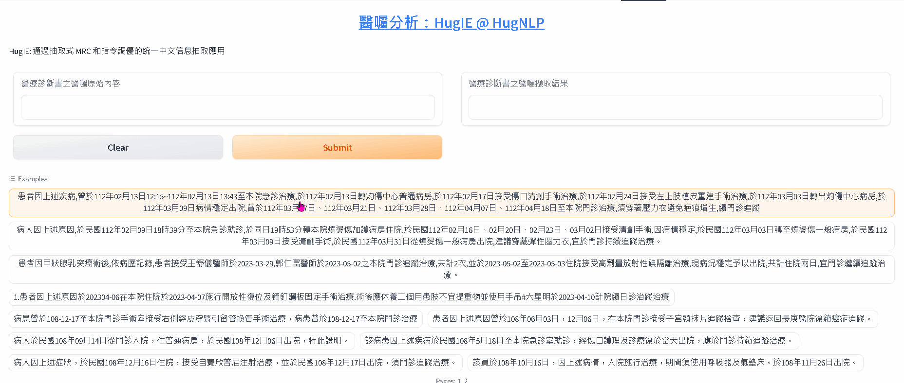
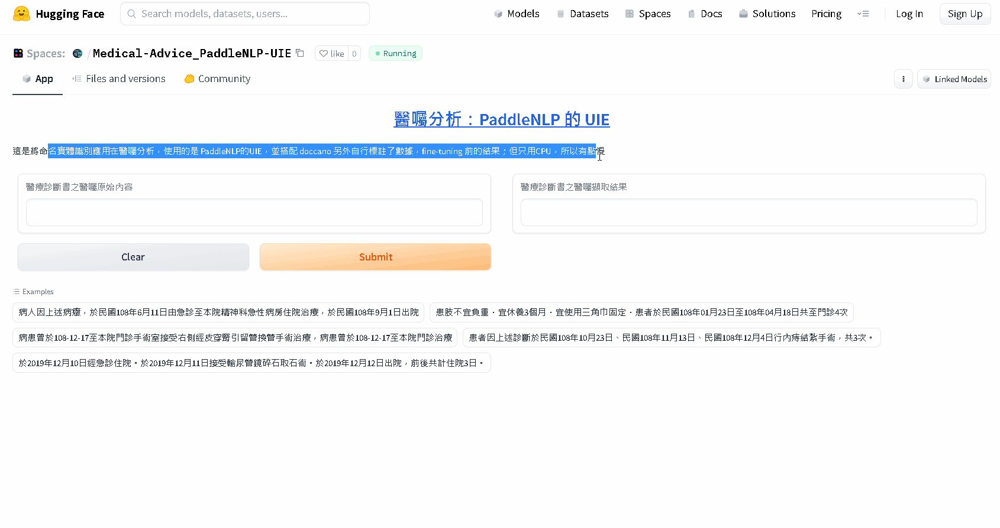

# Natural Language Processing, NLP (自然語言處理)
- [👥 LLM  (Large Language Model) 大語言模型簡介](#llm)
- [🥇 LLM  (Large Language Model) 相關論文](#相關論文)
- [📜 LLM  (Large Language Model) 相關連結](#相關連結)
- [📖 檢索增強生成（Retrieval-Augmented Generation, RAG）](#rag)
- [📊 LangChain](#langchain )
- [👥 LLM (Large Language Model) 部署開發相關](#llm-部署開發相關)
- [🥇 LLM (Large Language Model) 模型匯整](#llm-模型匯整)
- [📜 LLM (Large Language Model) 模型介紹](#llm-模型介紹)

#### [基於機器閱讀理解的指令微調的統一信息抽取框架之診斷書醫囑擷取分析](https://blog.twman.org/2023/07/HugIE.html)
#### https://huggingface.co/spaces/DeepLearning101/IE101TW
#### [那些自然語言處理 (Natural Language Processing, NLP) 踩的坑](https://blog.twman.org/2021/04/NLP.html)
#### [什麼是大語言模型，它是什麼？想要嗎？(Large Language Model，LLM)](https://blog.twman.org/2023/04/GPT.html)

#### https://www.twman.org/AI/NLP

#### https://huggingface.co/DeepLearning101

### ** 2018/07/15-2020/02/29 開發心得：**

自然語言處理（英語：Natural Language Processing，縮寫作 NLP）是人工智慧和語言學領域的分支學科。此領域探討如何處理及運用自然語言；自然語言處理包括多方面和步驟，基本有認知、理解、生成等部分。 自然語言認知和理解是讓電腦把輸入的語言變成有意思的符號和關係，然後根據目的再處理。自然語言生成系統則是把計算機數據轉化為自然語言。最後，放眼望去想入門 Attention、Transformer、Bert 和 李宏毅老師的教學影片等，絕對不能錯過。
雖然分享這些踩過的坑還有免費DEMO跟API其實我想不到有啥好處，但至少不用為了要營利而去亂喊口號也更不用畫大餅，能做多少就是說多少；如同搞 Deep Learning 101 搞那麼久，搬桌椅、直播場佈其實比想像中麻煩，只希望讓想投入的知道 AI 這個坑其實很深，多分享總是比較好 ! 

[Transformer - Attention is all you need](https://zhuanlan.zhihu.com/p/311156298)

[這麼多年，終於有人講清楚Transformer了](https://mp.weixin.qq.com/s/SJXxeTsqn9RoaVu66MISXQ)

[我從零實現了Transformer模型，把代碼講給你聽](https://zhuanlan.zhihu.com/p/411311520)

[Attention 機制](https://easyai.tech/ai-definition/attention/)

[超詳細圖解Self-Attention](https://zhuanlan.zhihu.com/p/410776234)

[NLP Course @ HuggingFace](https://huggingface.co/learn/nlp-course/zh-TW/chapter1/1)

關於自然語言處理，如果你在臺灣，那你第一時間應該會想到俗稱Chatbot的聊天機器人 (就是要人工維運關鍵字跟正規表示式的機器人)吧？從最早的中英文的情感分析，陸續接觸過文本糾錯(校正)、文本分類、文本相似度、命名實體識別、文本摘要、機器閱讀理解等，當然自然語言處理其實博大精深，還有像是分詞、詞性標註、句法分析、語言生成等，傳說中的知識圖譜 (Ontology？) 更是大魔王了；這邊僅先匯整接觸過的做說明，當然在深度學習還未爆紅前，已經有非常多的演算法，未來也盡量針對各個項目與領域持續更新簡單介紹，就當近幾次專題演講的摘要，也算是這幾年跟小夥伴們奮鬥NLP充滿血與淚的回憶；另外，根據經驗，論文當然要追，更要實作跟實驗，但算法模型其實效果已經都差不多，如果你想將算法實際落地，別懷疑，請好好的處理你的數據，這會是蠻關鍵的地方。另外，你一定也要知道 BERT家族，早在2018年11月，Google 大神釋出 BERT 後，就差不多屌打各種自然語言處理應用 (在這之前，你想搞自然語言處理，勢必用到騰訊所開源需要16GB記憶體的Tencent_ChineseEmbedding)，再後來還有像是 transformer 跟 huggingface，所以你一定要花點時間瞭解；當然，如果你真的沒太多時間投入去換跟處理數據然後重新訓練，那歡迎聯絡一下，用我們還持續迭代開發的臺灣深度大師啦，不然公開數據都是對岸用語或簡體跟英文還要擠GPU計算資源，你會很頭痛 ! 對啦，你也可以試試 NVIDIA GTC 2021 介紹的Javis等對話式AI等東西，但我想你還是會覺得不容易上手就是，除非你想自己從頭硬幹去瘋狂的標註適合自己場景的數據，然後瞭解怎樣重新訓練模型。

<strong>自然語言處理</strong>

  

  
Large Language Model (大語言模型)

  - [LangChain](https://github.com/Deep-Learning-101/Natural-Language-Processing-Paper#langchain)
  - [Retrieval Augmented Generation](https://github.com/Deep-Learning-101/Natural-Language-Processing-Paper#rag)
  - [LLM Model](https://github.com/Deep-Learning-101/Natural-Language-Processing-Paper#llm-%E6%A8%A1%E5%9E%8B%E4%BB%8B%E7%B4%B9)

  

  
  

  
Information/Event Extraction (資訊/事件擷取)

  - [HugNLP](https://github.com/Deep-Learning-101/Natural-Language-Processing-Paper/blob/main/HugNLP.md)
  - [DeepKE](https://github.com/Deep-Learning-101/Natural-Language-Processing-Paper/blob/main/DeepKE.md)
  - [ERINE-Layout](https://github.com/Deep-Learning-101/Natural-Language-Processing-Paper/blob/main/ERNIE-Layout.md)
  - [UIE @ PaddleNLP](https://huggingface.co/spaces/DeepLearning101/PaddleNLP-UIE)
    - https://github.com/PaddlePaddle/PaddleNLP/tree/develop/model_zoo/uie

  

  

### ** 2018/10/15-2019/02/10 開發心得：**
投入約120天，早期想上線需要不少計算資源 (沒有昂貴的GPU想上線簡直是難如登天，好險時代在進步，現在CPU就能搞定)。記得我2018從老闆口中第一次聽到新項目是機器閱讀理解時，一頭霧水不知道是在幹麼，Google後突然發現這還真是它X的超級難的東西，而當時落地場景是要解決機器人在博物館或者展場的Q&A，不想再預先建一堆關鍵字與正規表示式來幫相似度和分類做前處理。
但機器閱讀理解坑真的不小，首先當然是數據，公開數據有SQuAD 1.0和2.0，但這是英文，你想用在中文 ? 你可以自己試試啦，再來有了個中文的CMRC，但用得是對岸用語跟簡體中文，而且數據格式不太一樣；後來台達電放出了DRCD還有科技部辦的科技大擂台，依然有格式不同的問題，數據量真的不太夠，所以想要落地你真的得要自己標註。
為了解決像是多文章還有問非文章內問題，還有公開數據要嘛英文不然就是簡體中文或對岸用語，然後本地化用語的數據實在不足的狀況，小夥伴們真的很給力，我們也用機器翻譯SQuAD 1.0和2.0還有自己手工爬維基百科跟開發了數據標註系統自己標註 ! 不得不說小夥伴們真的是投入超多精神在機器閱讀理解，更在Deep Learning 101做了分享。

  
Machine Reading Comprehension (機器閱讀理解)

  - [中文機器閱讀理解](https://www.twman.org/AI/NLP/MRC)
    - [機器閱讀理解綜述(一)](https://zhuanlan.zhihu.com/p/80905984)
    - [機器閱讀理解綜述(二)](https://zhuanlan.zhihu.com/p/80980403)
    - [機器閱讀理解綜述(三)](https://zhuanlan.zhihu.com/p/81126870)
    - [機器閱讀理解探索與實踐](https://zhuanlan.zhihu.com/p/109309164)
    - [什麼是機器閱讀理解？跟自然語言處理有什麼關係？](https://communeit.medium.com/%E4%BB%80%E9%BA%BC%E6%98%AF%E6%A9%9F%E5%99%A8%E9%96%B1%E8%AE%80%E7%90%86%E8%A7%A3-%E8%B7%9F%E8%87%AA%E7%84%B6%E8%AA%9E%E8%A8%80%E8%99%95%E7%90%86%E6%9C%89%E4%BB%80%E9%BA%BC%E9%97%9C%E4%BF%82-b02fb6ccb6e9)

  

  

### ** 2019/12/02-2020/02/29 開發心得：**
記得前後兩次陸續投入總計約100天。或許有人會發現為何在分享這幾篇自然語言會強調中文數據？最好理解的說法就是中文是基於字表示再加上中文斷詞的效果，比起每個單詞只需空格來表示的英文硬是麻煩點。命名實體識別 (Named Entity Recognition, NER) 是指將語句中的元素分成預先定義的類別 (開放域來說包括實體、時間和數字3個大類，人名、地名、組織名、機構名、時間、日期、數量和名字等7個小類，特定領域就像是藥名、疾病等類別)。要應用在那方面？像是關係抽取、對話意圖理解、輿情分析、對話NLU任務等等都用得上，更廣義的就屬填槽 (Slot-Filling) 了。
最早 (2019/08時) 我們需處理的場景是針對電話助理的對話內容 (就是APP幫你接電話跟對方對話) 在語音識別後跟語音合成前的處理，印像中沒做到非常深入；後來剛好招聘到熟悉NER這部份的小夥伴們，剛好一直想把聊天對話做個流程處理 (多輪對話的概念) ，就再花了點時間當做上手，因為不想依賴大量關鍵字和正規表示式做前處理，中間試了不少數據集，還做了像是用拼音、注音等，或者品牌定義等超多的實驗，甚至還一度想硬整合 RASA 等等的開源套件，也嘗試用了 "改寫" 來修正對話內容，去識別出語句中的重點字。至於這個的數據標據就真的更累人，意外找到一個蠻好用的標註系統 ChineseAnnotator，然後我們就瘋狂開始標註 !

  
Named Entity Recognition (命名實體識別)

  - [中文命名實體識別](https://www.twman.org/AI/NLP/NER)

  

  

### ** 2019/11/20-2020/02/29 開發心得：**
投入約100天，早期上線成本資源頗高，現在就沒這問題；這個項目堪稱是在NLP這個坑裡投入第二多的，記得當時的場景是機器人在商場裡回答問題所顯示出來的文字會有一些ASR的錯字，但是問題一樣卡在數據集，還因此讓小夥伴們花了好長時間辛苦去標註 XD，但看看現在效果，我想這是值得的 ! 記得一開始是先依賴 pycorrector，然後再換 ConvSeq2Seq，當然 bert 也做了相關優化實驗，中間一度被那三番二次很愛嗆我多讀書，從RD轉職覺得自己很懂做產品的PM拿跟百度對幹，從一開始的看實驗結果輸，到後來贏了，卻又自己亂測說還是不夠好之類的叭啦叭啦，說實話，你最後不也人設垮了然後閃人 ~ 攤手 ~ 
現在看看這截圖效果，不是蠻勵害的嗎 ? 真的想說這社會真的充滿一堆人設嚇死人的人，無敵愛嘴砲 ! 搞的為了滿足那位人設比天高的需求，真的是想了像是用拼音還兼NER來整合的好幾種方法 ! 那文本糾錯會有什麼坑呢？：數據啊、格式啊 !!! 還有幾個套件所要處理的目標不太一樣，有的可以處理疊字有的可以處理連錯三個字，還有最麻煩的就是斷字了，因為現有公開大家最愛用的仍舊是Jieba，即便它是有繁中版，當然也能試試 pkuseg，但就是差了點感覺。

  
Correction (糾錯)

  - [中文文本糾錯](https://www.twman.org/AI/NLP/Correction)

  

  

### ** 2019/11/10-2019/12/10 開發心得：**
最早我們是透過 Hierarchical Attention Networks for Document Classification (HAN) 的實作，來修正並且以自有數據進行訓練；但是這都需要使用到騰訊放出來的近16 GB 的 embedding：Tencent_AILab_ChineseEmbedding_20190926.txt，如果做推論，這會是個非常龐大需載入的檔案，直到後來 Huggingface 橫空出世，解決了 bert 剛出來時，很難將其當做推論時做 embedding 的 service (最早出現的是 bert-as-service)；同時再接上 BiLSTM 跟 Attention。CPU (Macbook pro)：平均速度：約 0.1 sec/sample，總記憶體消耗：約 954 MB (以 BiLSTM + Attention 為使用模型)。
引用 Huggingface transformers 套件 bert-base-chinese 模型作為模型 word2vec (embedding) 取代騰訊 pre-trained embedding
優點：API 上線時無須保留龐大的 Embedding 辭典,避免消耗大量記憶體空間，但BERT 相較於傳統辭典法能更有效處理同詞異義情況，更簡單且明確的使用 BERT 或其他 Transformers-based 模型
缺點：Embedding後的結果不可控制，BERT Embedding 維度較大,在某些情況下可能造成麻煩

  
Classification (分類)

  - [中文文本分類](https://www.twman.org/AI/NLP/Classification)

  

  

### ** 2019/10/15-2019/11/30 開發心得：**
投入約45天，那時剛好遇到 albert，但最後還是被蒸溜給幹掉；會做文本相似度主要是要解決當機器人收到ASR識別後的問句，在進到關鍵字或正規表示式甚至閱讀理解前，藉由80/20從已存在的Q&A比對，然後直接解答；簡單來說就是直接比對兩個文句是否雷同，這需要準備一些經典/常見的問題以及其對應的答案，如果有問題和經典/常見問題很相似，需要可以回答其經典/常見問題的答案；畢竟中文博大精深，想要認真探討其實非常難，像是廁所在那裡跟洗手間在那，兩句話的意思真的一樣，但字卻完全不同；至於像是我不喜歡你跟你是個好人，這就是另一種相似度了 ~ xDDD ! 那關於訓練數據資料，需要將相類似的做為集合，這部份就需要依賴文本分類；你可能也聽過 TF-IDF 或者 n-gram 等，這邊就不多加解釋，建議也多查查，現在 github 上可以找到非常的範例程式碼，建議一定要先自己動手試試看 !

  
Similarity (相似度)

  - [中文文本相似度](https://www.twman.org/AI/NLP/Similarity)

  

## HugNLP
[Jianing Wang, Nuo Chen, Qiushi Sun, Wenkang Huang, Chengyu Wang, Ming Gao, "HugNLP: A Unified and Comprehensive Library for Natural Language Processing", arXiv preprint, 	arXiv:2302.14286, 2023](./HugNLP.md)

[基於機器閱讀理解(MRC)的指令微調(Instruction-tuning)的統一信息抽取框架之診斷書醫囑擷取分析](https://blog.twman.org/2023/07/HugIE.html)

## DeepKE
[Ningyu Zhang, Xin Xu, Liankuan Tao, Haiyang Yu, Hongbin Ye, Shuofei Qiao, Xin Xie, Xiang Chen, Zhoubo Li, Lei Li, Xiaozhuan Liang, Yunzhi Yao, Shumin Deng, Peng Wang, Wen Zhang, Zhenru Zhang, Chuanqi Tan, Qiang Chen, Feiyu Xiong, Fei Huang, Guozhou Zheng, Huajun Chen, "DeepKE: A Deep Learning Based Knowledge Extraction Toolkit for Knowledge Base Population", arXiv preprint, arXiv:2201.03335, 2022](./DeepKE.md)

[基於深度學習的開源中文知識圖譜抽取框架](https://github.com/zjunlp/DeepKE/blob/main/README_CN.md)

[DeepKE-LLM: A Large Language Model Based Knowledge Extraction Toolkit](https://github.com/zjunlp/DeepKE/blob/main/example/llm/README_CN.md)

[知識增強的開源語言大模型框架](https://github.com/zjunlp/KnowLM/blob/main/README_ZH.md)

## ERNIE-Layout
[Qiming Peng, Yinxu Pan, Wenjin Wang, Bin Luo, Zhenyu Zhang, Zhengjie Huang, Teng Hu, Weichong Yin, Yongfeng Chen, Yin Zhang, Shikun Feng, Yu Sun, Hao Tian, Hua Wu, Haifeng Wang, "ERNIE-Layout: Layout Knowledge Enhanced Pre-training for Visually-rich Document Understanding", arXiv preprint, arXiv:2210.06155, 2022](./ERNIE-Layout.md)

## PaddleNLP
https://github.com/PaddlePaddle/PaddleNLP

https://huggingface.co/spaces/DeepLearning101/PaddleNLP-UIE

#
# LLM
**大語言模型 (Large Language Model) 簡介**

[**AlpacaEval Leaderboard**](https://tatsu-lab.github.io/alpaca_eval/)

[**Open LLM Leaderboard**](https://huggingface.co/spaces/HuggingFaceH4/open_llm_leaderboard)

[**Awesome-Chinese-LLM**](https://github.com/HqWu-HITCS/Awesome-Chinese-LLM)

[人工智慧大語言模型微調技術：SFT 監督微調、LoRA 微調方法、P-tuning v2 微調方法、Freeze 監督微調方法](https://zhuanlan.zhihu.com/p/643941480)

[【LLM】從零開始訓練大模型](https://zhuanlan.zhihu.com/p/636270877)

## **相關論文**

* UnIVAL: Unified Model for Image, Video, Audio and Language Tasks：https://arxiv.org/pdf/2307.16184.pdf
    *  https://unival-model.github.io
* Revisiting Relation Extraction in the era of Large Language Models：https://arxiv.org/abs/2305.05003
    * [用LLM(大模型)進行關係抽取](https://mp.weixin.qq.com/s/eQL-yvz7JIuObY1CUe2gsw)
* [A Survey on Language Models for Code](https://arxiv.org/abs/2311.07989)
    * [首篇程式碼產生大模型論文綜述](https://zhuanlan.zhihu.com/p/667402546)
    * [涵蓋500多項研究、50多個模型，代碼大模型綜述來了](https://www.jiqizhixin.com/articles/2023-11-22-8)
* [Source Code Data Augmentation for Deep Learning: A Survey](https://arxiv.org/abs/2305.19915)
    * [Data Augmentation Approaches for Source Code Models](https://github.com/terryyz/DataAug4Code)
    * [歷數5年89篇研究，這篇綜述告訴我們深度學習中的程式碼資料增強怎麼樣了](https://www.jiqizhixin.com/articles/2023-11-23-3)

## **相關連結**

* [transformers_tasks](https://github.com/HarderThenHarder/transformers_tasks/tree/main/LLM)  
* [超級AI助理：全新提升！中文NLP訓練框架，快速上手，海量訓練數據，ChatGLM-v2、中文Bloom、Dolly助您實現更智能的應用！](https://zhuanlan.zhihu.com/p/652256798)

### RAG
* [Graph RAG：知識圖譜結合LLM 的檢索增強](https://siwei.io/graph-rag/)
* [一文讀懂RAG和LLM微調，教你結合業務場景落地LLM應用](https://mp.weixin.qq.com/s/NcWyI00m2RrnibdzXqy_qQ)
* [LangChain - RAG：線上系統多文檔要頻繁更新](https://mp.weixin.qq.com/s/Klz0ddtqa08_5q7MqX8HXg)

### LangChain
* [LangChain 入門：構建LLM 支持的應用程序的初學者指南](https://zhuanlan.zhihu.com/p/631948940)
* [LangChain中文入門教程](https://github.com/liaokongVFX/LangChain-Chinese-Getting-Started-Guide)
* [大語言模型集成工具LangChain](https://zhuanlan.zhihu.com/p/599688026)
* [LangChain-ChatGLM-Webui](https://github.com/thomas-yanxin/LangChain-ChatGLM-Webui)
* [Langchain-Chatchat/Langchain-ChatGLM](https://github.com/chatchat-space/langchain-ChatGLM)
* [基於本地知識的問答機器人langchain-ChatGLM](https://zhuanlan.zhihu.com/p/622717995)
* [LlamaIndex：輕鬆構建索引查詢本地文檔的神器](https://zhuanlan.zhihu.com/p/638827267)
* [LlamaIndex——与LangChain类似但更专注于数据处理的LLM框架](https://cloud.tencent.com/developer/article/2333511)
* [langchain大模型外掛知識庫問答系統核心部件：如何更好地解析、分割複雜非結構化文本](https://mp.weixin.qq.com/s/rOWfCQuUPohatMF_dU2nIA)
* [一文詳解最熱的LLM 應用框架LangChain](https://zhuanlan.zhihu.com/p/651151321)
* [LangChain：打造自己的LLM 落地場景實作！](https://zhuanlan.zhihu.com/p/651150077)
* [langchain+xray，好玩起来了](https://mp.weixin.qq.com/s/qKFkUdvNWumanqGE6s6jUw)
* [利用LangSmith和Lilac微調你的大模型](https://mp.weixin.qq.com/s/zOM_5kpkjApDTqt9IcXstA)

### LLM 部署開發相關
* [**AutoGen**](https://github.com/microsoft/autogen)
    * [逐步掌握最佳Ai Agents框架-AutoGen](https://juejin.cn/post/7305230279812218890)：https://github.com/sugarforever/AutoGen-Tutorials
    * [微軟AutoGen框架太火了，智能體聊聊天就把問題解決了](https://www.jiqizhixin.com/articles/2023-10-16-11)
    * [我打通了Autogen和Bing搜尋| AutoGen系列第二篇](https://mp.weixin.qq.com/s/O8s_3K6yRB597i5swCV2Ew)
    * [Streamlit + AutoGen = 基於LLM的多代理網頁應用開發](https://mp.weixin.qq.com/s/nT55YPBviAiU3OWvdnLjjQ)
    * [使用Streamlit建立AutoGen使用者介面](https://zhuanlan.zhihu.com/p/665636978)
* [Flowise ——通過拖放界面構建定制的LLM流程](https://cloud.tencent.com/developer/article/2296201)
    * [Flowise｜無代碼ChatBot 構建平台｜LangChain](https://zhuanlan.zhihu.com/p/635304135)    
* [**NVIDIA AI Foundation Models**](https://developer.nvidia.com/nemotron-3-8b)
    * [NVIDIA AI Foundation Models：使用生產就緒型LLM 建置自訂企業聊天機器人和智慧副駕](https://zhuanlan.zhihu.com/p/667838746)
    * [NVIDIA 透過企業級生成式人工智慧微服務為聊天機器人、Copilot 和摘要工具帶來商業智慧](https://blogs.nvidia.com.tw/2023/11/29/nemo-retriever-generative-ai-microservice/)
* [**TensorRT-LLM**](https://github.com/NVIDIA/TensorRT-LLM)
    * [NVIDIA TensorRT-LLM 增強了 NVIDIA H100 GPU 上大型語言模型的推論能力](https://blogs.nvidia.com.tw/2023/09/11/nvidia-tensorrt-llm-supercharges-large-language-model-inference-on-nvidia-h100-gpus/)
    * [Nvidia開源TensorRT-LLM函式庫強化H100 GPU大型語言模型推論效能](https://www.ithome.com.tw/news/158687)
* [**FastGPT**](https://fastgpt.run)
    * https://doc.fastgpt.run/docs/intro/
    * [利用Docker Compose快速部署FastGPT知识库问答](https://mp.weixin.qq.com/s/wkQuYtK8iEI-SzHn9ihUKQ)
* [**XAgent**](https://github.com/OpenBMB/XAgent)：https://github.com/OpenBMB/XAgent
    * [全面超越AutoGPT，面壁智慧聯合清華NLP實驗室開源大模型「超級英雄」XAgent](https://www.jiqizhixin.com/articles/2023-10-17-7)
    * [驕傲！清華XAgent完勝ChatGPT4.0！](https://www.wehelpwin.com/news/91)
* [**Dify**](https://dify.ai/)
    * https://github.com/langgenius/dify
    * https://docs.dify.ai/v/zh-hans/
    * [這支十餘人的年輕創業團隊如何在2 個月做出一個 LLMOps 平台](https://zhuanlan.zhihu.com/p/666614787)    
* [**HuggingChat**](http://hf.co/chat)：Powered by Open Assistant's latest model – the best open source chat model right now – and Hugging Face Inference API.
    * [chat ui](https://github.com/huggingface/chat-ui)
* [PromptFlow — 微軟最新開源的基於LLM的開發工具集](https://zhuanlan.zhihu.com/p/666139473)：https://github.com/microsoft/promptflow
* [用bitsandbytes、4 位元量化和QLoRA 打造親民的LLM](https://huggingface.co/blog/zh/4bit-transformers-bitsandbytes)
* [用LLaMA 2.0, FAISS and LangChain實現基於知識問答](https://zhuanlan.zhihu.com/p/651428758)
* [LMDeploy](https://github.com/InternLM/lmdeploy/blob/main/README_zh-CN.md)：[使用LMDeploy 輕鬆部署Llama-2 系列模型！](https://zhuanlan.zhihu.com/p/645877584)
* [LLMStack：一個用於構建生成式AI 應用、聊天機器人、智能體的無代碼平台](https://mp.weixin.qq.com/s/YhIQJhafdglPLirJBi6LLg)
    * https://github.com/trypromptly/LLMStack
* [LLaMA2-Accessory](https://github.com/Alpha-VLLM/LLaMA2-Accessory)
* [AutoChain : LangChain 的替代品](https://mp.weixin.qq.com/s/v4c4JzXiVEJfwi9CQbJ2Tg)
* [LangFlow：一款可輕鬆實驗和原型化 LangChain 模擬的 AI 項目](https://mp.weixin.qq.com/s/omHZ_IqjISphmdGz3tiMnQ)

### LLM 模型匯整
* [大型語言模型綜述全新出爐：從T5到GPT-4最全盤點！](https://zhuanlan.zhihu.com/p/619526209)
* [現有開源中文LLM整理](https://zhuanlan.zhihu.com/p/630577059)
* [大模型LLM-微調經驗分享&總結](https://zhuanlan.zhihu.com/p/620885226)
* [Hugging Face 的文本生成和大語言模型的開源生態](https://huggingface.co/blog/zh/os-llms)
* [構建能夠使用CPU 運行的MetaAI LLaMA2 中文大模型](https://zhuanlan.zhihu.com/p/645426799)
* [復旦NLP團隊發表80頁大模型Agent綜述，一文綜觀AI智能體的現況與未來](https://www.jiqizhixin.com/articles/2023-09-19-8)

### LLM 模型介紹

* [**Xwin-LM**](https://github.com/Xwin-LM/Xwin-LM)
    * [首次擊敗GPT-4？700億參數Xwin-LM登頂史丹佛AlpacaEval，13B模型吊打ChatGPT](https://www.kuxai.com/article/1449)
    * [Xwin-LM-7B-V0.2](https://huggingface.co/Xwin-LM/Xwin-LM-7B-V0.2)
    * [Xwin-LM-13B-V0.2](https://huggingface.co/Xwin-LM/Xwin-LM-13B-V0.2)
* [**Zephyr**](https://huggingface.co/HuggingFaceH4)
    * [最好7B模型再易主！打敗700億LLaMA2，蘋果電腦就能跑，還開源免費](https://zhuanlan.zhihu.com/p/663816617)
    * [實戰｜如何低成本訓練一個可以超越70B Llama2 的模型Zephyr-7B](https://zhuanlan.zhihu.com/p/663782256)
    * [使用者意圖對齊，無需人工標註，Zephyr-7B 超越Llama2-Chat-70B](https://cloud.tencent.com/developer/article/2354363)
    * [Zephyr-7B-β：類GPT高性能LLM大模型](https://zhuanlan.zhihu.com/p/664820726)：https://huggingface.co/spaces/HuggingFaceH4/zephyr-chat
* [neural-chat-7b-v3@INTEL](https://huggingface.co/Intel/neural-chat-7b-v3)
    * [Efficient LLM inference on CPUs](https://hackmd.io/@VitasLu/r1BoroKVa)
    * [Intel® Extension for Transformers](https://github.com/intel/intel-extension-for-transformers)
    * [Intel-Optimized Llama.CPP](https://medium.com/@NeuralCompressor/llm-performance-of-intel-extension-for-transformers-f7d061556176)
* [**Mistral**](https://huggingface.co/mistralai/Mistral-7B-v0.1)
    * [Mistral 7B 開箱 — 真正意義上的開源 LLM 模型](https://blog.infuseai.io/mistral-7b-introduction-2f6857f6982b)
    * [Mistral AI：歐洲最強模型團隊，打造開源輕量LLM](https://new.qq.com/rain/a/20231123A08N4100)
* [**Baichuan**](https://github.com/Baichuan-inc/Baichuan-13B)：https://huggingface.co/baichuan-inc
    * https://huggingface.co/baichuan-inc/Baichuan-13B-Base
    * https://huggingface.co/baichuan-inc/Baichuan-13B-Chat
    * [實戰！私有化部署RAG大模型，ChatGLM2-6B還是Baichuan2-13B](https://www.luxiangdong.com/2023/10/09/ragllm/#/%E8%AF%95%E7%94%A8Baichuan2-13B)
    * [Baichuan2-13B 量化及 API 部署](https://mp.weixin.qq.com/s/7qf4ncRLfdvjpfhKNgqEow)
    * [百川智能發表Baichuan2大模型：全面領先Llama2，訓練切片也開源了](https://www.jiqizhixin.com/articles/2023-09-06-6)
* [**01-ai/Yi**](https://huggingface.co/01-ai)
    * [零一萬物Yi-34B-Chat 微調模型及量化版正式上線](https://zhuanlan.zhihu.com/p/668635998)
    * [零一萬物發布大模型Yi-34B，李開復：堅定進軍全球第一梯隊目標](https://www.mittrchina.com/news/detail/12627)
    * [李開復：用大模型創造Super APP是最大的商機](https://www.mittrchina.com/news/detail/12642)
    * [基於LLaMA卻改張量名，李開復公司大模型開源行為引發爭議，官方回應來了](https://www.jiqizhixin.com/articles/2023-11-14-4)
* [**Fengshenbang-LM(封神榜大模型)**](https://github.com/IDEA-CCNL/Fengshenbang-LM)：https://huggingface.co/IDEA-CCNL
    * [Ziya2: Data-centric Learning is All LLMs Need](https://arxiv.org/pdf/2311.03301.pdf)
    * [Ziya2-13B-Base](https://huggingface.co/IDEA-CCNL/Ziya2-13B-Base)
    * [社群動態| 封神榜團隊揭秘大模型訓練秘密：以資料為中心](https://hub.baai.ac.cn/view/32516)
    * [IDEA研究院Ziya2-13B首发魔搭社区（含社区推理微调最佳实践教程）](https://zhuanlan.zhihu.com/p/661623603)
    * [Never Lost in the Middle: Improving Large Language Models via Attention Strengthening Question Answering](https://arxiv.org/abs/2311.09198)
    * [多項長篇文本任務第一，揭秘Ziya-Reader 訓練技術：注意力增強](https://hub.baai.ac.cn/view/32706)
* [**Chat GLM**](https://github.com/THUDM/ChatGLM3)
    * [ChatGLM3 使用Demo及效果測試](https://zhuanlan.zhihu.com/p/664036961)
    * [當ChatGLM3能用搜尋引擎時](https://mp.weixin.qq.com/s/FAhPO_3hWOdOssssRmVFUQ)
* [Falcon 180B Demo](https://huggingface.co/spaces/tiiuae/falcon-180b-demo)
    * [Falcon 180B Model](https://huggingface.co/tiiuae/falcon-180B)
    * [Falcon 180B 目前最強大的開源模型](https://zhuanlan.zhihu.com/p/655709522)    
* [天工@崑崙萬維](https://github.com/SkyworkAI/Skywork)
    * [崑崙萬維發布「天工SkyAgents」平台，零程式碼打造AI智能體](https://www.jiqizhixin.com/articles/2023-12-01)
    * [天工Skywork-13B開源模型的煉成與思考](https://zhuanlan.zhihu.com/p/664985891)
    * [崑崙萬維開源百億級大語言模型，配套150B開源中文資料集](https://36kr.com/p/2496563965695876)
    * [中文最強開源大模型來了！130億參數，0門檻商用，來自崑崙萬維](https://zhuanlan.zhihu.com/p/664108647)
* [Meta Llama 2](https://ai.meta.com/llama)：https://github.com/facebookresearch/llama
    * [Llama 2：開放式基礎和微調聊天模型](https://zhuanlan.zhihu.com/p/648030318)
    * [Llama 2 來襲 - 在 Hugging Face 上玩轉它](https://huggingface.co/blog/zh/llama2)
    * [中文LLaMA模型和指令精調的Alpaca大模型：中文數據進行二次預訓練](https://cloud.tencent.com/developer/article/2306028)
    * [千元預算半天訓練，效果媲美主流大模型，開源可商用中文LLaMA-2](https://www.jiqizhixin.com/articles/2023-09-25-16)
    * [所有基準測試都優於Llama 2 13B，最好的7B模型來了，免費用](https://www.jiqizhixin.com/articles/2023-09-29-2)
* [MOSS](https://github.com/OpenLMLab/MOSS)
    * https://txsun1997.github.io/blogs/moss.html
* Bloom：
    * https://huggingface.co/spaces/sambanovasystems/BLOOMChat
    * [176B竟然可以辣麼快，效果直逼chatgpt-4直接hf在線體驗，還可以商用](https://mp.weixin.qq.com/s/9ero7t8WRyehpVRdD0rZWA)
    * [逼近GPT-4！BLOOMChat: 开源可商用支持多语言的大语言模型](https://zhuanlan.zhihu.com/p/631036519)    
* [Dolly](https://github.com/databrickslabs/dolly)
    * [Databricks公布生成性AI模型Dolly，強調比ChatGPT更容易訓練](https://www.ithome.com.tw/news/156128)
    * [全球首個完全開源的大語言模型Dolly，性能堪比 GPT3.5！](https://www.techbang.com/posts/105519-open-source-dolly-gpt)
    * [世界首款真開源類ChatGPT大模型Dolly 2.0，可隨意修改商用](https://zhuanlan.zhihu.com/p/621655147)
    * [Databricks開源可商用的指令遵循大型語言模型Dolly 2.0](https://www.ithome.com.tw/news/156407)
* [XVERSE](https://github.com/xverse-ai/XVERSE-13B)
    * [130億參數大模型免費商用！性能超Llama2-13B，支持8k上下文](https://zhuanlan.zhihu.com/p/649643798)
    * [國內最大開源模型發布，無條件免費商用！參數650億，基於2.6兆token訓練](https://zhuanlan.zhihu.com/p/665270135)    
* [MPT-7B](https://www.mosaicml.com/blog/mpt-7b)：A New Standard for Open-Source, Commercially Usable LLMs
    * https://huggingface.co/mosaicml/mpt-7b
    * https://huggingface.co/spaces/mosaicml/mpt-7b-instruct
    * [MosaicML 推出70 億參數模型MPT-7B-8，號稱一次處理8000 字長文本、可商用](https://mp.weixin.qq.com/s/ZLotkvr9IEl91cLeu6jC6w)
    * [最新發布！截止目前最強大的最高支持65k輸入的開源可商用AI大模型：MPT-7B！](https://www.datalearner.com/blog/1051683422426508)
* [OpenBMB/CPM-Bee](https://github.com/OpenBMB/CPM-Bee)
    * [VisCPM：SOTA 開源中文多模態大模型](https://zhuanlan.zhihu.com/p/640750889)
* [Open Assistant](https://projects.laion.ai/Open-Assistant/)
    * [Open Assistant： 創造一場開源革命](https://zhuanlan.zhihu.com/p/62259607)
    * [AI趨勢周報第208期：AI趨勢周報第208期：AI社群發起Open Assistant專案，要打造與第三方互動的AI助理](https://www.ithome.com.tw/news/155472)
    * [OpenAssistant 12B(pythia-based)本地部署快速體驗(ChatGPT開源、可商用的平替)](https://zhuanlan.zhihu.com/p/622358878)
    * [OpenAssistant  對話- 民主化大型語言模型對齊（Open-Assistant）](https://zhuanlan.zhihu.com/p/624051115)
    * [全球最大ChatGPT開源平替來了！支持35種語言，寫代碼、講笑話全拿捏](https://zhuanlan.zhihu.com/p/616917667)
* [Cerebras-GPT](https://github.com/Cerebras/modelzoo)
    * [免費可商用開源GPT模型來了，50G權重直接下載，性能不輸GPT-3](https://zhuanlan.zhihu.com/p/618893184)
    * [Open Compute-Optimal Language Models Trained on the Cerebras Wafer-Scale Cluster](https://www.cerebras.net/blog/cerebras-gpt-a-family-of-open-compute-efficient-large-language-models/)
* OpenBuddy
    * [OpenBuddy - 面向全球用户的开源多语言聊天机器人](https://github.com/OpenBuddy/OpenBuddy/blob/main/README.zh.md)
    * [OpenBuddy 發布基於Llama 2 的新一代跨語言對話模型，開源可商用](https://www.oschina.net/news/250986)
    * [OpenBuddy發布650億參數的大型跨語言對話模型](https://mp.weixin.qq.com/s/xZ0ejXwLcjGTurQFOws8lQ)
* h2oGPT：https://github.com/h2oai/h2ogpt
    * [基於H2O.ai生態系統的開源可商用大語言模型](https://zhuanlan.zhihu.com/p/645600655)
* 文心@百度：
    * https://wenxin.baidu.com
* 混元@騰訊：
    * https://cloud.tencent.com/product/hunyuan    
* 通義千問(QWEN)@阿里：
    * https://huggingface.co/Qwen/Qwen-72B
    * https://github.com/QwenLM/Qwen-7B
    * https://tongyi.aliyun.com/
    * [720億參數大模型都拿來開源了！通義千問開源全家桶，最小18億模型端側都能跑](https://www.jiqizhixin.com/articles/2023-12-01-5)
    * [免費、可商用，阿里雲開源70億參數通義千問大模型](https://www.jiqizhixin.com/articles/2023-08-04-6)
    * [開源語音大語言模型來了！阿里基於Qwen-Chat提出Qwen-Audio!](https://zhuanlan.zhihu.com/p/668608727)